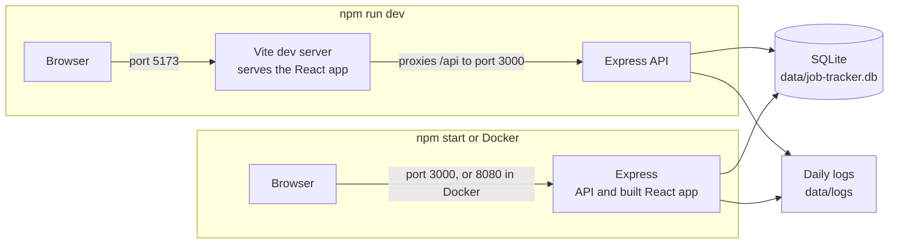
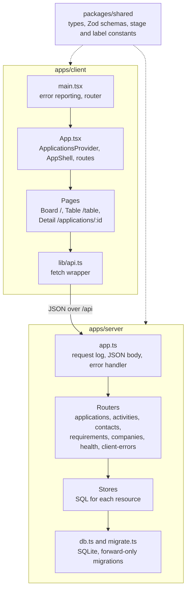
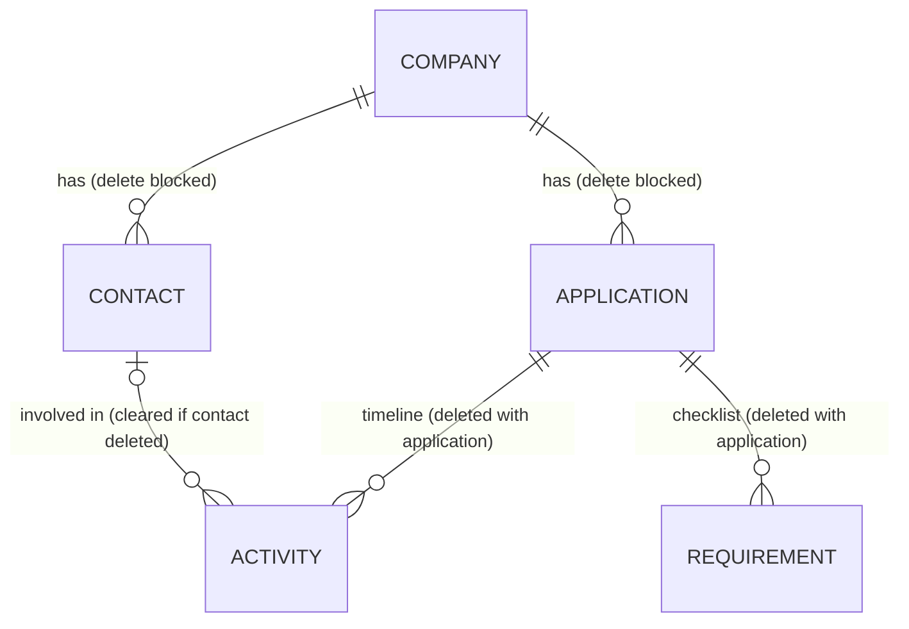
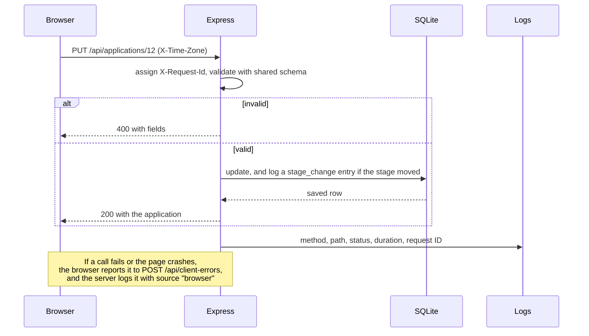

# job-tracker

A personal tracker for job applications, built with spec-driven development.

- Stack: TypeScript, Express, React, and SQLite in an npm workspaces monorepo.
- Process: every feature starts as a spec in `docs/specs/`. See `docs/specs/README.md`.
- Plan: the planned features and their order are in `docs/roadmap.md`.

## What it does

- A board with one column per stage: Wishlist, Applied, Screening, Interviewing, Offer, Accepted, Rejected, and Withdrawn. Drag a card to another column to change its stage.
- A table view of the same applications that you can search, filter by stage, work mode, and employment type, and sort by any column. The search, filters, and sort are kept in the page address, so a view survives a reload and can be bookmarked. A Kanban/Table switch moves between the two views.
- A sidebar on every screen that lists each stage with its live count. Click a stage to open the table filtered to it.
- A detail page for each application (`/applications/:id`) with its job details, a timeline, and a requirements checklist.
- **Timeline:** log notes, emails, calls, and interviews, each with a date and optionally the contact involved. The app adds an entry itself when an application is added and whenever its stage changes.
- **Contacts:** keep people at a company, such as a recruiter or hiring manager, with a role, email, phone, and notes. Contacts belong to the company, so one person can be reused across every application there.
- **Requirements:** list what a job requires or prefers and check each off as you meet it. The checklist shows a summary such as "2/3 required met".
- Light and dark themes, with a toggle in the header.
- Add, edit, and delete applications in a side panel. Each has a company, a job title, a stage, and a next step with a due date. Overdue next steps are highlighted.
- The applied date, the closed date, and the time in the current stage are recorded automatically.
- Company names are suggested as you type and are matched regardless of case.
- Each application can keep its job details: link (with an "Open posting" shortcut), location, work mode, employment type and contract length, salary range in USD, source, and description. Salary amounts can be typed as "140,000" or "140k", and links without `https://` get it added.
- Logs every API request and server event to the terminal and to daily log files, reports browser errors to the same logs, and shows a "Something went wrong" screen instead of a blank page if the app crashes.

## Setup

Requires Node.js 24 or later.

```sh
npm install
npm run dev
```

`npm run dev` starts the API at `http://localhost:3000` and the web app at `http://localhost:5173`. The web app proxies `/api` requests to the API. Press Ctrl+C to stop both.

On first start, the server creates the SQLite database and applies any pending migrations.

## Run with Docker

Requires Docker with Compose. You don't need Node or `npm install`.

```sh
docker compose up --build --force-recreate
```

Open `http://localhost:8080`. The app is reachable only from this machine. Stop it with Ctrl+C or `docker compose down`. It doesn't restart on its own.

- **Logs:** `docker compose logs` shows the readable log, and the daily log files are in `data/docker/logs/`. Their dates are in UTC, the container's time zone.
- **Data:** Docker's database is `data/docker/job-tracker.db`, kept separate from the one `npm run dev` uses. It survives rebuilds, and you can back it up by copying the folder while the app is stopped.
- **Always use `--force-recreate`.** Without it, Compose restarts a stopped container (for example, one stopped with Ctrl+C) on the old image, so code and migration changes are skipped.
- **Don't open Docker's database from your machine while the container is running.** SQLite's WAL mode can't coordinate across Docker's file sharing.
- **The log says port 3000.** That's the port inside the container. Use 8080 from your machine.
- **Linux:** the container runs as the `node` user (uid 1000). If Docker creates `data/docker/` as root, run `sudo chown 1000:1000 data/docker`. Docker Desktop on macOS doesn't need this.

## Production build without Docker

```sh
npm run build
npm start
```

`npm start` serves the built page and the API together at `http://localhost:3000`, using the same database as `npm run dev`. Run `npm run build` again after changing the client.

## Architecture

### How it runs

In development, Vite serves the web app and proxies `/api` to the API. In production and in Docker, one Node process serves the built web app and the API together. Either way, the API owns one SQLite file and writes daily log files next to it.



In Docker, the database and logs live in `data/docker/` instead, kept apart from the ones `npm run dev` uses.

### How the code fits together

`packages/shared` holds the types and the validation rules (Zod schemas), and both the server and the web app import them, so the two sides agree on every request and response.



### How the data fits together

Contacts belong to a company, not to one application, so the same person can show up on several applications' timelines.



The tables are created by the SQL files in `apps/server/migrations/`, which run in order on startup.

### What happens on a request

Every request gets an ID that appears on the response and in every log line for it. The server validates the body with the shared schema before touching the database.



## Commands

| Command             | What it does                                       |
| ------------------- | -------------------------------------------------- |
| `npm run dev`       | Starts the API and web app with reload on changes  |
| `npm run build`     | Builds the client for production                   |
| `npm start`         | Serves the production build and the API            |
| `npm test`          | Runs all tests in every workspace                  |
| `npm run lint`      | Lints the whole repo                               |
| `npm run typecheck` | Typechecks every workspace                         |

## Configuration

| Variable        | Default                | Purpose                                       |
| --------------- | ---------------------- | --------------------------------------------- |
| `PORT`          | `3000`                 | The API's port. The client's dev proxy expects `3000`. |
| `DATABASE_PATH` | `data/job-tracker.db`  | The SQLite file. The `data/` folder is gitignored. |
| `LOG_LEVEL`     | `debug`, or `info` in production | `debug`, `info`, `warn`, or `error`. Lines below this level aren't logged. |

## Logs

The server logs to the terminal as readable lines, and to one file per day as JSON, one object per line.

- **Where:** a `logs` folder next to the database, such as `data/logs/2026-10-01.log`. Files older than 7 days, counting today, are deleted automatically.
- **What:** each API request with its status and duration, plus startup, migrations, shutdown, and errors. The page, static files, and health checks are logged only at `debug`. Request bodies are logged only at `debug`, which is the default in development.
- **Browser errors:** uncaught errors, crashes while rendering, and failed API calls are sent to the server and logged with `"source": "browser"`. The browser sends at most 10 a minute.
- **Request IDs:** every response has an `X-Request-Id` header, and every log line for that request carries the same ID. A `500` response includes it as `requestId`, so you can find the error with, for example, `grep <id> data/logs/*.log`.

## API

The client talks to a small JSON API under `/api`:

| Method and path | What it does |
| --------------- | ------------ |
| `GET /api/health` | Status, version, uptime, database status with the latest migration, and API request and 5xx error counts since startup. Returns `503` when the database can't answer. |
| `GET /api/applications` | Lists applications in board order |
| `GET /api/applications/:id` | Returns one application |
| `POST /api/applications` | Creates an application |
| `PUT /api/applications/:id` | Replaces an application's editable fields |
| `DELETE /api/applications/:id` | Deletes an application, along with its timeline and requirements |
| `GET /api/applications/:id/activities` | Lists an application's timeline entries |
| `POST /api/applications/:id/activities` | Logs an entry: `type` (`note`, `email`, `call`, or `interview`), `occurredOn`, `text`, and an optional `contactId` |
| `PUT /api/activities/:id` | Changes an entry |
| `DELETE /api/activities/:id` | Deletes an entry |
| `GET /api/applications/:id/requirements` | Lists an application's requirements |
| `POST /api/applications/:id/requirements` | Adds a requirement: `text`, `kind` (`required` or `preferred`), and `met` |
| `PUT /api/requirements/:id` | Changes a requirement |
| `DELETE /api/requirements/:id` | Deletes a requirement |
| `GET /api/companies` | Lists companies by name |
| `GET /api/companies/:id/contacts` | Lists a company's contacts |
| `POST /api/companies/:id/contacts` | Adds a contact: `name`, and optional `role`, `email`, `phone`, and `notes` |
| `PUT /api/contacts/:id` | Changes a contact |
| `DELETE /api/contacts/:id` | Deletes a contact. Timeline entries that named it are kept, with no contact |
| `POST /api/client-errors` | Logs an error reported by the browser: `kind`, `message`, `page`, and optional `stack` and `api` |

Writes accept an optional `X-Time-Zone` header with an IANA time zone, such as `America/Chicago`. The server uses it to work out "today" for the applied and closed dates. The browser always sends it. Without it, the server's own time zone is used (UTC in Docker).

Invalid input returns `400` with `{ "error": "...", "fields": { "<field>": "<message>" } }`. An unexpected error returns `500` with `{ "error": "Internal server error", "requestId": "..." }`.

Application fields are `companyName`, `jobTitle`, `stage`, `nextStep`, `nextStepDue`, and `appliedOn`, plus the optional job details: `jobLink`, `location`, `workMode` (`onsite`, `hybrid`, or `remote`), `employmentType` (`full_time`, `contract`, or `part_time`), `contractLengthMonths`, `salaryMin`, `salaryMax`, `salaryPeriod` (`annual` or `hourly`), `source`, and `jobDescription`. Salary amounts can be numbers or text such as `"140k"`.

## Layout

```
apps/server              Express API (run directly with Node's TypeScript support)
  src/<resource>/        A router and a store for each of applications, activities, contacts, requirements, and companies
  migrations/            Versioned SQL migrations: NNNN_snake_case.sql
  tests/                 API and database tests, mirroring src/
apps/client              React app built with Vite
  src/components/        Screens and pieces of the UI, each with its CSS beside it
  src/lib/               API calls, hooks, and helpers
  tests/                 Component and helper tests, mirroring src/
packages/shared          Types and validation shared by the API and web app
docs/                    Constitution, roadmap, and feature specs
```

## Testing

Tests use Vitest and live in each package's `tests/` folder, mirroring `src/`.

```sh
npm test                          # everything
npx vitest run <file>             # one file while you work
```

Run `npm test`, `npm run lint`, and `npm run typecheck` before committing.

## Contributing

This project uses spec-driven development, scaled to the size of the change. Read `docs/constitution.md` for the rules and `CLAUDE.md` for the three workflow tiers: a tweak needs no documents, a feature needs a spec and a plan, and a large feature also needs a task list. Work happens on `feature/<short-name>` branches off `development`, and `development` is merged into `main` after review.
